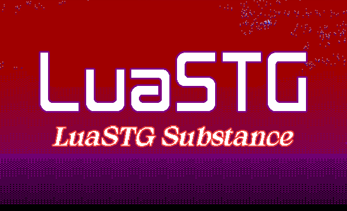

# LuaSTG Retro  

---

## Introduction
Luastg-Retro was developed as a fork of [LuaSTG Sub](https://github.com/Legacy-LuaSTG-Engine/LuaSTG-Sub) to cater to the interests of certain retro fans (it updates based on the main branch of LuaSTG Sub).

## Download

You can download from [Releases Page](). Usually displayed on the right or bottom (mobile GitHub page).  

## Major Migration Content

* Graphic API: Direct3D 9 to Direct3D 11
* Audio API: DirectSound to XAudio2

## Features(TODO)

* Added PMD Decoder (Complete) (Thanks [pmdwin](https://github.com/gzaffin/pmdwin)) (If you enable this feature, please read [this](./pmdwin.md).)
* Modify the game packaging method (TODO)
* Modify image scaling mode (TODO)

## Requirements

* Operating System: Windows 7 SP1 with platform update ([KB2670838](https://www.microsoft.com/en-us/download/details.aspx?id=36805)) or above
* Graphics Card: compatible with Direct3D11, Direct3D feature level is D3D_FEATURE_LEVEL_10_0 or above
* Audio Card: compatible with XAudio2

## Build Projects

See [Build Projects](./BUILD.md).

## Major Contributors

- 隔壁的桌子 (developer of vanilla LuaSTG)  
- [9chu](https://github.com/9chu) (developer of LuaSTG Plus)  
- [ESC](https://github.com/ExboCooope) (developer of LuaSTG Ex Plus)  
- [Xiliusha](https://github.com/Xiliusha) (developer of LuaSTG Ex Plus)  
- [璀境石](https://github.com/Demonese) (developer of LuaSTG Sub)  

---

## 介绍  

LuaSTG Retro 是作为 [LuaSTG Sub](https://github.com/Legacy-LuaSTG-Engine/LuaSTG-Sub) 的分支而进行开发的，旨在满足一些Retro玩家的爱好（它基于主分支LuaSTG Sub来更新）

其他分支收录在 [Legacy LuaSTG Engine 组织首页](https://github.com/Legacy-LuaSTG-Engine)。  

## 下载  

你可以从 [Releases 页面]() 下载，一般显示在右侧或者底部（手机版页面）。  

## 功能

* 增加PMD解码器 (感谢[pmdwin](https://github.com/gzaffin/pmdwin)) (启用此功能前请阅读[这个](./pmdwin.md)) 
* 修改引擎打包方式 (正在做)
* 修改引擎图像缩放模式 (正在做)

## 主要迁移内容  

* 图形 API：从 Direct3D 9 迁移到 Direct3D 11  
* 音频 API：从 DirectSound 迁移到 XAudio2  

## 配置要求  

* 系统要求：最低为 Windows 7 SP1 且安装平台更新（[KB2670838](https://www.microsoft.com/en-us/download/details.aspx?id=36805)）  
* 显卡需求：支持 Direct3D 11 且 Direct3D 功能级别至少为 D3D_FEATURE_LEVEL_10_0  
* 声卡需求：支持 XAudio2  

## 编译项目  

请阅读[编译项目](./BUILD.md)。

## 主要贡献者  

- 隔壁的桌子（LuaSTG 开发者）  
- [9chu](https://github.com/9chu)（LuaSTG Plus 开发者）  
- [ESC](https://github.com/ExboCooope)（LuaSTG Ex Plus 开发者）  
- [Xiliusha](https://github.com/Xiliusha)（LuaSTG Ex Plus 开发者）  
- [璀境石](https://github.com/Demonese)（LuaSTG Sub 开发者）  

